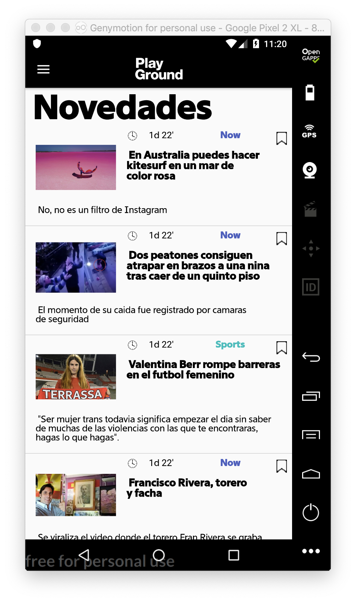
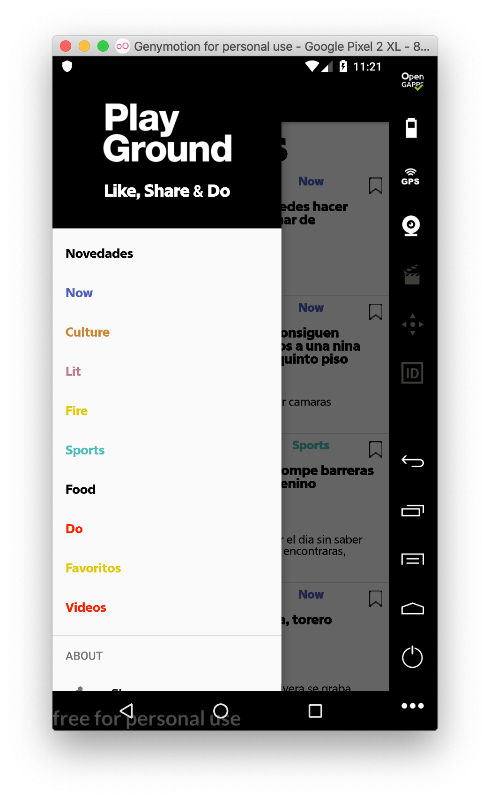
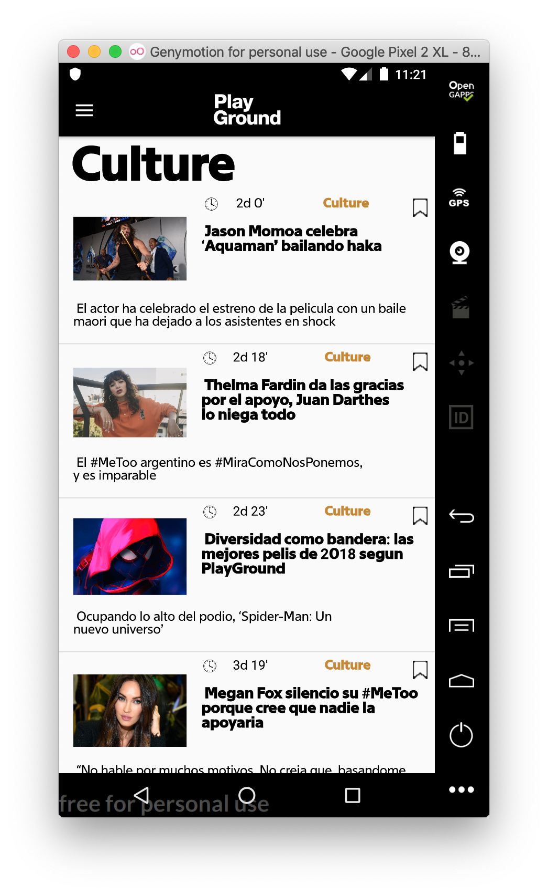
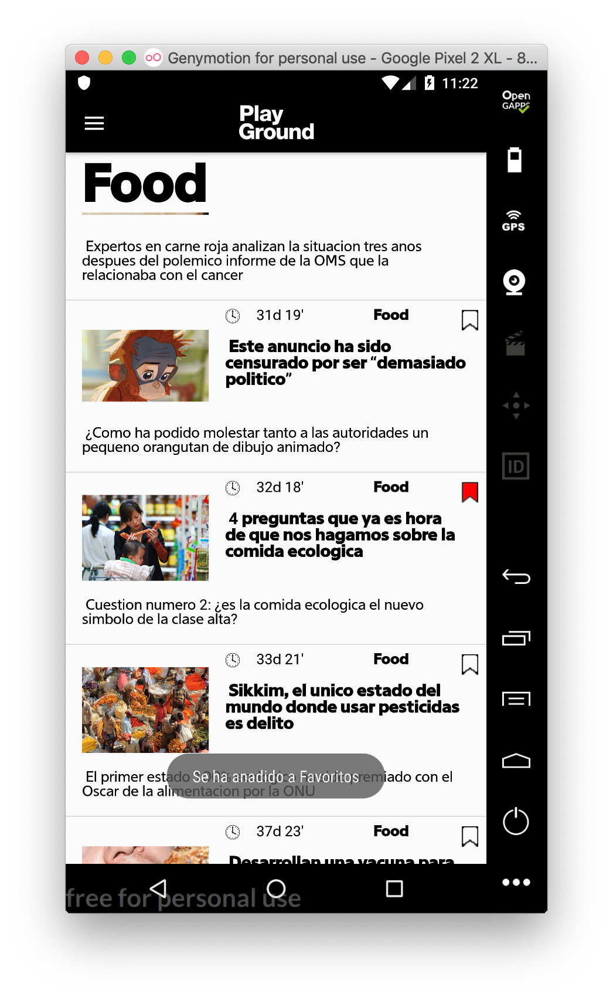
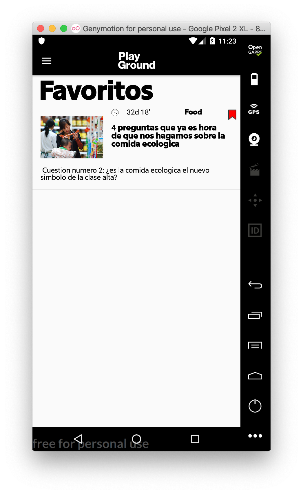
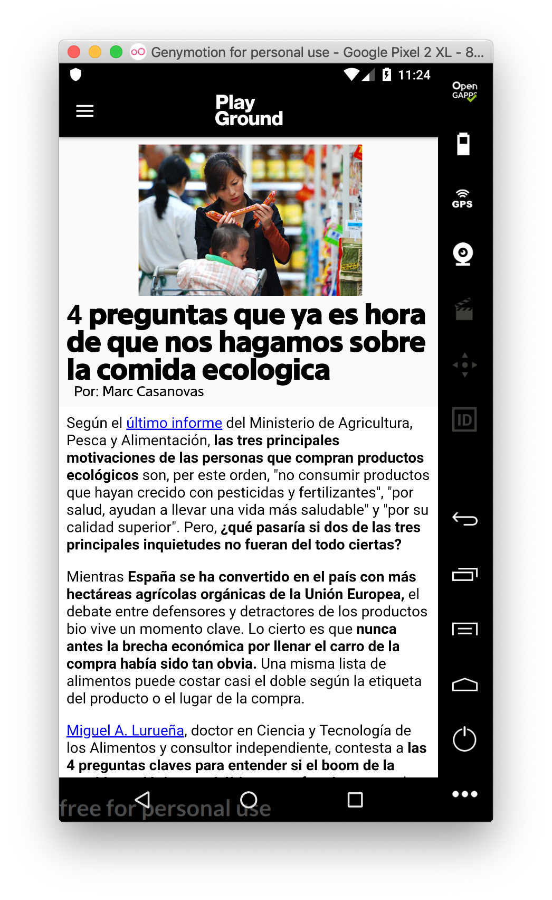
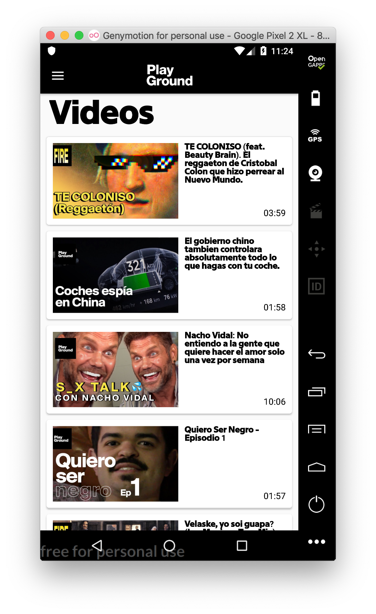

# Aplicación RSS para Android desarrollada con Java
En esta App se estaba estudiando el uso de ficheros XML en Android con Java y para el ejercicio de final de trimestre contacté con la plataforma PlayGround para ver si me podian proporcionar la RSS de su web.

La app se divide en las secciones que tienen sus noticias y incluye un botón para añadir la noticia que quieras a tu apartado de favoritos.

Tambien como la plataforma de PlayGround cuenta con un canal de YouTube muy interesante tambíen se ha añadido esa sección con unos cuantos videos todos reproduciendose desde el propio Youtube.

Debido a que la RSS no contenia todas las noticias, si no, se iban actualizando solo con las nuevas, para la realización de este proyecto se han ido guardado todas las noticias en un fichero a parte que se ha almacenado en un hosting propio que ya no esta activo por lo que la app puede que no funcione como debería.

Aquí van unas imágenes de la App:

